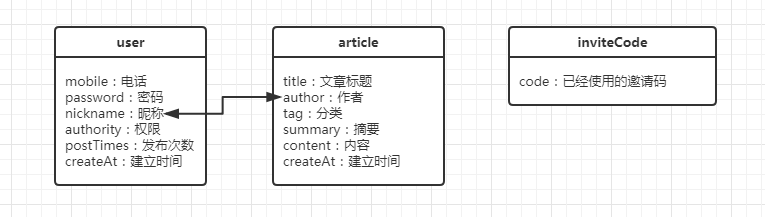

# egg api demo

a demo of egg.js api, using JWT, genHash, restful api。

### 本地调试

```
$ npm i
$ npm run dev
$ open http://localhost:7001/
```

### 配置

在config文件夹的config.default.js里面配置下面这些：

```
//配置cookie键
config.keys = appInfo.name + '_1513779989145_1652';

//配置白名单
config.security = {
    csrf: {
        enable: false
    },
    domainWhiteList: [ 'http://localhost:8000' ]
};

//配置超级管理员，管理员和邀请码等
config._local = {
    mobile: '13610161234', //超级管理员账号
    password: 'admin.', //超级管理员密码
    superAdminJwt: 'secret-super-admin', //超级管理员的jwt密钥
    adminMobile: [13600000001, 13600000002, 13600000003, 13600000004, 13600000005], //管理员账号，密码和账号相同
    adminJwt: 'secret-admin', //管理员的jwt密钥
    disableInviteCode: true, //是否关闭邀请码注册
    inviteMin: 100000, //邀请码最小值
    inviteMax: 999999, //邀请码最大值
};
```

### todo

- [x] 后台api
- [x] 加入jwt验证
- [x] 权限系统
- [x] 邀请码系统
- [x] 画一个高大上的数据库图
- [x] 写一个高大上的api文档
- [ ] 后台react页面

### 数据库



### api

[api文档](https://sishenhei7.github.io/egg.js-api-demo-/api/api_docs)


